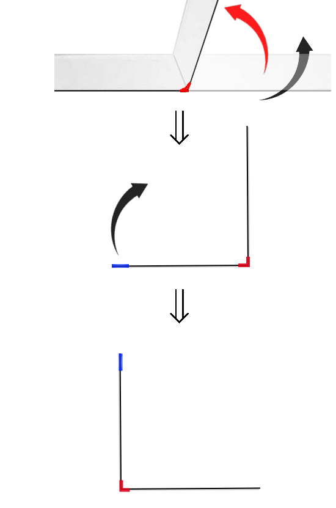

# La Courbe du dragon

## Étape 1, un "L" (1 pli)

 

1) Plier la feuille à angle droit et
2) tenir la feuille devant soi, vue de la tranche, 
3) ensuite pivoter votre bandelette de manière à voir un "L" (vu d'en haut) :

 

  

## Question 1

 

Imaginez une fourmi qui part de la gommette bleue en haut du "L" et qui parcoure le long de la tranche pour arriver à l'autre bout de la feuille !

Elle part tout droit, puis tourne d'1/4 de tour vers SA gauche ou vers SA droite ?

!!!!!! (réponse : gauche)

  

## Étape 2, noter le chemin de la fourmi :

 

Notez maintenant sur la 2e feuille : "étape 1 :" puis tracez le "L" obtenu, puis indiquez le chemin de la fourmi **en notant "G" pour "Gauche" et "D" pour "Droite"**

  

## Question 2

 

Combien de virages a fait la fourmi ?

!!!!!! (réponse : 1)

  

## Étape 3, noter le nombre de virages :

 

Ajouter maintenant sur la 2e feuille, toujours à l'étape 1 : "nombre de virages : " puis indiquez le nombe correct ! 

  

## Question 3

 

En supposant que la bandelette de feuille fait 0,1mm d'épaisseur et 21cm en longueur, quel est l'épaisseur et quelle est la longueur de la bandelette pliée en 2 ?

!!!!!! (réponse : 0,1mm * 2 = 0,2mm d'épaisseur et 21cm/2 = 10,5cm de long)

  

## Étape 4, noter les dimensions de la bandelette de papier :

 

Ajouter maintenant sur la 2e feuille, toujours à l'étape 1 : "épaisseur feuille pliée : " puis indiquez le calcul correct, puis "et longueur : " et indiquer le calcul correct !
