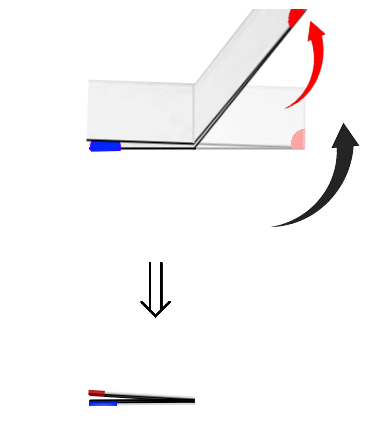

# La Courbe du dragon

## Étape 2

 

étape 2a (2 plis) : replier la bandelette de papier, puis plier à nouveau en 2 parties égales. NE PAS DEPLIER ! Devinette : si on déplie (comme avant) en formant uniquement des angles droits (combien y en aura-t-il ?) et qu'on place la feuille comme à l'étape 1 (avec le point du milieu au même endroit), essayez de deviner le dessin que l'on va obtenir
étape 2b (2 plis) : poser la bandelette sur la tranche pour voir le dessin vu d'en haut (on doit voir le point de départ en haut et le point du milieu au milieu) et vérifier que c'est bien le bon dessin ! Imaginez de nouveau une fourmi qui part du point bleu en haut du dessin et qui parcoure le long de la tranche pour arriver à l'autre bout de la feuille. Elle part tout droit, puis tourne (chaque fois d'1/4 de tour) vers ... ? (- réponse QCM : DROITE-GAUCHE-GAUCHE) Notez sur la 2e feuille : "étape 2 :" puis tracez le dessin obtenu, puis indiquez le chemin de la fourmi  **en notant "G" pour "Gauche" et "D" pour "DROITE"** (D G G).
question 2c : combien de virages a fait la fourmi ? (- réponse QCM : 3 virages -)
question 2d : puisqu'à l'étape précédente, la bandelette de feuille faisait 0,2mm d'épaisseur et 10,5cm de long, quel est l'épaisseur et quelle est la longueur de la bandelette pliée à cette étape-ci ? (écrir le calcul !) (- réponse QCM : 0,2mm * 2 = 0,4mm d'épaisseur et 10,5cm/2 = 5,25cm de long). Ajouter en fin de ligne sur la 2e feuille : "épaisseur feuille pliée : 0,2mm x 2 = 0,4mm et longueur : 10,5cm / 2 = 5,25cm".
