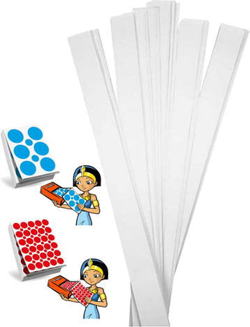
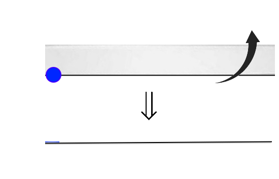

# La Courbe du dragon

## Introduction

La courbe du dragon est obtenue par des plis successifs d'un segment de droite.

Nous pouvons utiliser une bandelette de papier vue de sa tranche pour construire manuellement cette courbe.

- Pour visualiser plus facilement le début de la courbe, nous utiliserons une gommette bleue

- Pour visualiser plus facilement le milieu de la courbe, nous utiliserons une gommette rouge

## Matériel nécessaire

## Préparation - 1

Coller une moitié de gommette bleue en bas à gauche de la bandelette de manière à ce que celle-ci dépasse de moitié la bandelette :

## Préparation - 2

Replier la gommette bleue pour que celle-ci se colle de l'autre côté :

## Préparation - 3

Plier la bandelette en 2 de manière à ramener le côté droit sur le côté gauche (avec la gommette bleue)

## Préparation - 4

Déplier la bandelette et coller une moitié de gommette rouge en bas de la bandelette, au niveau du pli du milieu.

! Comme avec la gommette bleue, on colle la gommette de manière à ce que celle-ci dépasse de moitié la bandelette :

## Préparation - 5

Replier la gommette rouge pour que celle-ci se colle de l'autre côté :

## En route vers la courbe du dragon !

Nous sommes maintenant prêts pour construire manuellement une courbe du dragon !